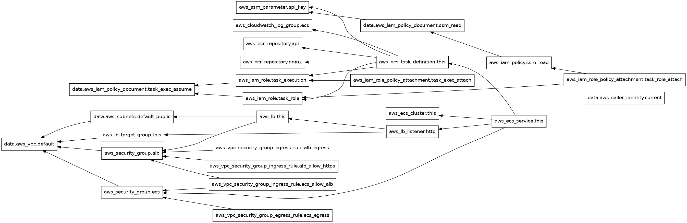
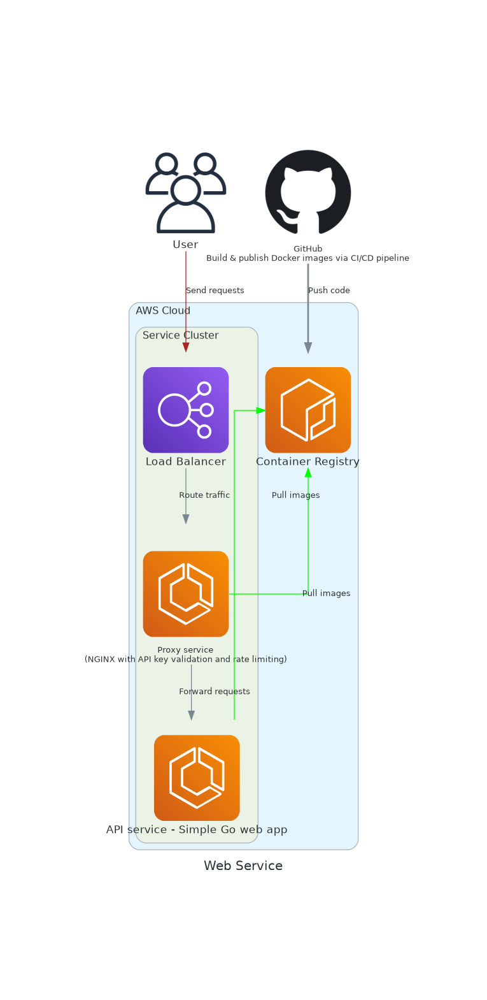

# Zama DevOps/SRE Challenge – Golang + AWS (ECS Fargate) + Nginx

A tiny developer-facing API operated with pragmatic SRE practices:
- **Service**: Go HTTP server with `/healthz`, `/readyz`, and `POST /sum`.
- **API management**: Nginx sidecar as reverse proxy (rate limit + API key) in front of the Go app.
- **Security**: API key required for non-health endpoints; key stored in **AWS SSM Parameter Store** and injected to Nginx via ECS Task Definition secrets. Ingress restricted by ALB/SG.
- **Reliability**: Separate readiness vs liveness, graceful shutdown, ECS rolling deploy.
- **Containerisation**: Dockerfile per component.
- **Provisioning/Deployment**: Terraform on **AWS** (uses the default VPC + subnets to stay minimal). Includes **CloudWatch Logs**, **dashboard**, and **alarm**.
- **Observability**: Structured JSON logs from Nginx and app to CloudWatch; a small dashboard + one alert (ALB 5xx spikes).

> You **don't** need a live env for submission. Include a saved `plan.txt` and an image of the Terraform graph (see below).



---

## Architecture

The overall system architecture is visualized in `arch_diagram.png`, which shows:

- **Application Layer**: Go API service with health/readiness endpoints and business logic
- **Proxy Layer**: Nginx reverse proxy providing API key authentication and rate limiting
- **Container Orchestration**: AWS ECS Fargate tasks running both containers as a unified service
- **Load Balancing**: Application Load Balancer distributing traffic and performing health checks
- **Security**: API keys stored in AWS SSM Parameter Store, injected at runtime
- **Networking**: Default VPC with public subnets for ALB and private networking for ECS tasks
- **Observability**: CloudWatch Logs for centralized logging, CloudWatch Dashboard for metrics, and CloudWatch Alarms for alerting
- **Container Registry**: Amazon ECR for storing Docker images



---

## Local development

### Option 1: Using Docker Compose (Recommended)

The easiest way to run the application locally is with Docker Compose, which orchestrates both the API and Nginx services:

```bash
# Start both services (builds images if needed) and run in detached mode
docker-compose up -d --build
```

The `docker-compose.yaml` file defines:
- **API service**: Go HTTP server on port `8080` with `REQUIRE_API_KEY=false` for local testing
- **Nginx service**: Reverse proxy on port `8081` with API key `CHANGEME`, automatically configured to communicate with the API service via Docker networking
- **Service dependencies**: Ensures the API starts before Nginx

To stop the services:
```bash
docker-compose down
```

### Option 2: Manual Docker commands

Alternatively, build and run containers manually:

```bash
# Build images
docker build -t zama-api:local -f services/api/Dockerfile ./services/api
docker build -t zama-nginx:local -f services/nginx/Dockerfile ./services/nginx

# Run both (two shells) or using `docker run --network host` on Linux:
# Shell A: run API
docker run --rm -p 8080:8080 -e REQUIRE_API_KEY=false zama-api:local

# Shell B: run Nginx proxy (front-end) with API key and rate limit
# NOTE: Replace CHANGEME with a key of your choice. Health endpoints don't require a key.
docker run --rm -p 8081:80 -e API_KEY=CHANGEME zama-nginx:local
```

### Testing locally

Once the services are running (via either method), test the endpoints:

```bash
# healthz (no key needed)
curl -s localhost:8081/healthz

# readyz (becomes ready ~2s after boot)
curl -s localhost:8081/readyz

# sum (requires key)
curl -s -H 'X-Api-Key: CHANGEME' -H 'Content-Type: application/json'   -d '{"a": 2, "b": 40}' localhost:8081/sum
```

---

## AWS Deploy (Terraform)

> Minimal footprint: uses **default VPC and subnets**. If your account doesn’t have a default VPC, adapt `terraform/networking.tf` to create one.

### 0) Prereqs
- AWS credentials configured (e.g., `aws configure`).
- Terraform >= 1.5, Docker, and `jq` installed.

### 1) ECR repos and image push
Terraform creates two ECR repos. Build & push images (replace region/account, and set an image tag, e.g. git SHA):
```bash
# Get AWS Account ID (bash example)
ACCOUNT_ID=$(aws sts get-caller-identity --query Account --output text)
REGION=eu-west-1
TAG=v0.1.0

aws ecr get-login-password --region $REGION |   docker login --username AWS --password-stdin ${ACCOUNT_ID}.dkr.ecr.${REGION}.amazonaws.com

# Build
docker build -t ${ACCOUNT_ID}.dkr.ecr.${REGION}.amazonaws.com/zama-api:${TAG} -f services/api/Dockerfile ./services/api
docker build -t ${ACCOUNT_ID}.dkr.ecr.${REGION}.amazonaws.com/zama-nginx:${TAG} -f services/nginx/Dockerfile ./services/nginx

# Push
docker push ${ACCOUNT_ID}.dkr.ecr.${REGION}.amazonaws.com/zama-api:${TAG}
docker push ${ACCOUNT_ID}.dkr.ecr.${REGION}.amazonaws.com/zama-nginx:${TAG}
```

### 2) Terraform init/plan/apply
Fill out `terraform/terraform.tfvars` (copy from example):
```bash
cp terraform/terraform.tfvars.example terraform/terraform.tfvars
# Edit values, ensure `api_key_value` is set (non-empty).
```

Then:
```bash
cd terraform
terraform init
terraform validate
terraform plan -out plan.bin
terraform show -no-color plan.bin > ../plan.txt   # <- include this file in repo submission
# Optional: graph
terraform graph | dot -Tpng > ../terraform-graph.png
```

### 3) Test in AWS
After `apply`, Terraform will output the ALB DNS name:
```bash
ALB_DNS_NAME = my-alb-123456.eu-west-1.elb.amazonaws.com
```

Call endpoints (replace `API_KEY` with your value):
```bash
curl -s http://ALB_DNS_NAME/healthz
curl -s http://ALB_DNS_NAME/readyz
curl -s -H "X-Api-Key: YOUR_VALUE" -H 'Content-Type: application/json'   -d '{"a":10,"b":15}' http://ALB_DNS_NAME/sum
```

---

## CI/CD Pipeline

The project includes a **GitHub Actions** workflow (`.github/workflows/ci.yml`) that automates testing, building, and deployment.

### Pipeline Overview

The pipeline runs on every push to `main` and on pull requests, executing three sequential jobs:

#### 1. **Build & Test** (`build-test`)
- Sets up Go 1.25.3 environment
- Runs unit tests: `cd services/api && go test ./...`
- Validates code quality before proceeding to build stage

#### 2. **Docker Build & Push** (`docker-build-push`)
- **Authentication**: Uses AWS OIDC (OpenID Connect) for secure, keyless authentication to AWS
- **ECR Login**: Authenticates to Amazon ECR using `aws-actions/amazon-ecr-login@v2`
- **Image Tagging**: Tags images with the short commit SHA (first 7 characters) for traceability
- **Build**: Constructs both `zama-api` and `zama-nginx` Docker images
- **Push**: Pushes images to ECR repositories in the configured region (`eu-west-1`)

#### 3. **Terraform** (`Terraform`)
- **Init**: Initializes Terraform backend and providers
- **Validate**: Runs `terraform validate` to check configuration syntax
- **Dynamic tfvars**: Generates `terraform.tfvars` from GitHub secrets and environment variables:
  - Uses the image tag from the previous build step
  - Retrieves API key from GitHub secrets (`API_KEY_VALUE`)
  - Sets deployment parameters (region, desired count, etc.)
- **Plan**: Creates an execution plan and saves output to `plan.txt`
- **Artifact**: Uploads `plan.txt` as a GitHub Actions artifact for review

### Required GitHub Secrets

Configure these secrets in your GitHub repository settings:

- `AWS_OIDC_ROLE_ARN`: ARN of the AWS IAM role for OIDC authentication (requires trust relationship with GitHub OIDC provider)
- `API_KEY_VALUE`: The API key value to be stored in SSM Parameter Store

### Environment Variables

- `AWS_REGION`: Target AWS region (default: `eu-west-1`)

### Permissions

The workflow requires specific permissions:
- `id-token: write` – for AWS OIDC authentication
- `contents: read` – for repository checkout

### Manual Deployment

While the pipeline automates plan generation, `terraform apply` is intentionally manual. To deploy:

```bash
cd terraform
# Review the plan from CI artifacts or run locally
terraform apply zama-plan
```

This approach provides a safety gate, allowing review of infrastructure changes before applying them to production.

---

## Observability

- **Logs**: Both Nginx and the Go service emit JSON logs -> CloudWatch Logs group `/ecs/zama-challenge`.
- **Dashboard**: A small CloudWatch dashboard with ALB 5xx + ECS CPU.
- **Alarm**: `ALB 5xx` spikes alarm (customizable in `terraform/cw.tf`).

---

## Operating in Incidents

- **Elevated 5xx**: Check CloudWatch alarm + dashboard. Inspect ALB target health and ECS service events. Review app logs in CloudWatch.
- **Unhealthy targets**: Ensure `/readyz` returns 200. ECS uses ALB target health to avoid routing to non-ready tasks.
- **API throttling**: Nginx rate-limit is 5 r/s (burst 5). Adjust in `services/nginx/default.conf.template`.
- **Credential issues**: Confirm SSM parameter exists and the ECS Task Role has `ssm:GetParameter` on it.

---

## Trade-offs & Notes

- **Default VPC** keeps Terraform short and readable. For prod, use a dedicated VPC with private subnets, NAT or VPC endpoints, and TLS at ALB.
- **Nginx in-task proxy** provides the requested “API management layer” without running a separate gateway. In a larger system, consider Kong/Tyk/API Gateway + WAF.
- **Metrics** use `expvar` (stdlib, JSON). In a real setup, wire Prometheus/OpenTelemetry + AMG/AMP or Grafana Cloud.
- **Secrets** are injected to Nginx from **SSM** via ECS Task Definition. Health endpoints bypass the API key for liveness/readiness.
- **Tests**: The API includes one unit test for `/sum` and a quick `/healthz` test.

---

## If I had more time
- Add HTTPS at ALB (ACM cert) + HSTS.
- Swap to **Amazon Managed Prometheus** + **Managed Grafana** with richer dashboards + SLOs.
- Use **AWS WAF** in front of ALB (rate-based rules, IP allowlists/deny).
- Rollout strategy: blue/green with CodeDeploy + weighted target groups.
- CI/CD: full GitHub Actions pipeline with Atlantis(interactive working via PR comments), auto-plan, auto-merge.
- **Policy-as-code & Security Scanning**:
  - **tfsec/Checkov**: Integrate static analysis tools to scan Terraform code for security misconfigurations before deployment. These tools detect issues like unencrypted storage, overly permissive security groups, missing encryption at rest/in transit, and AWS best practice violations. Run as part of CI to fail builds on critical findings.
  - **Container Scanning**: Implement vulnerability scanning for Docker images using tools like Trivy, Grype, or AWS ECR native scanning. Scan images for known CVEs in base images and dependencies during the build process. Set severity thresholds (e.g., fail on HIGH/CRITICAL vulnerabilities) to prevent vulnerable images from reaching production.
  - **Image Signing (Sigstore Cosign)**: Cryptographically sign container images after building to ensure supply chain integrity. Use Cosign to generate signatures that verify images haven't been tampered with between build and deployment. ECS can be configured to only pull signed images, preventing unauthorized or modified containers from running. Integrate keyless signing with OIDC for a smoother CI/CD experience.

---

## AI coding assistance
I used an LLM to accelerate boilerplate (Terraform scaffolding, Nginx template), then manually reviewed and simplified for clarity. What worked well: rapidly assembling consistent scaffolds. What didn’t: validating every AWS knob offline—still need to run `terraform validate/plan` and minor fixes in a real account.
