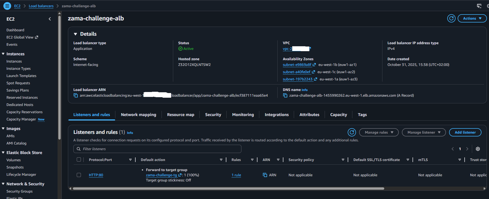
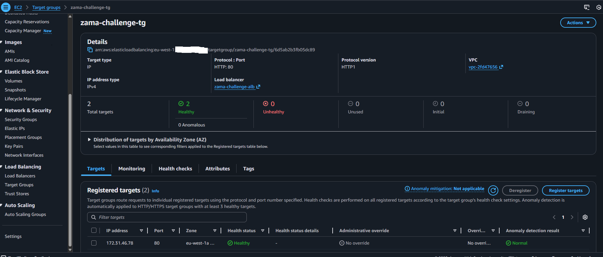
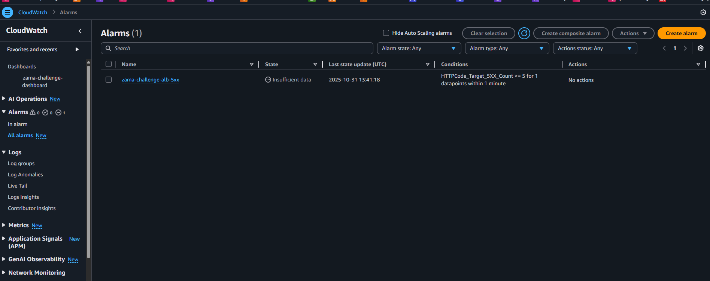
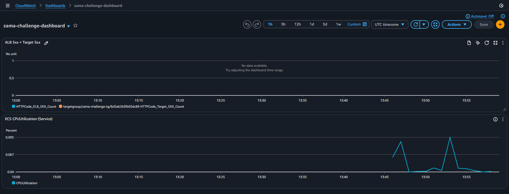
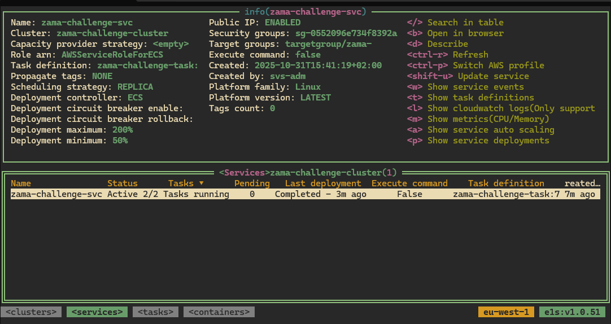
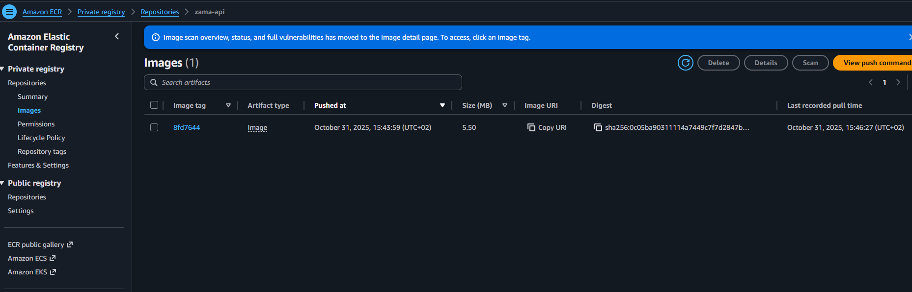
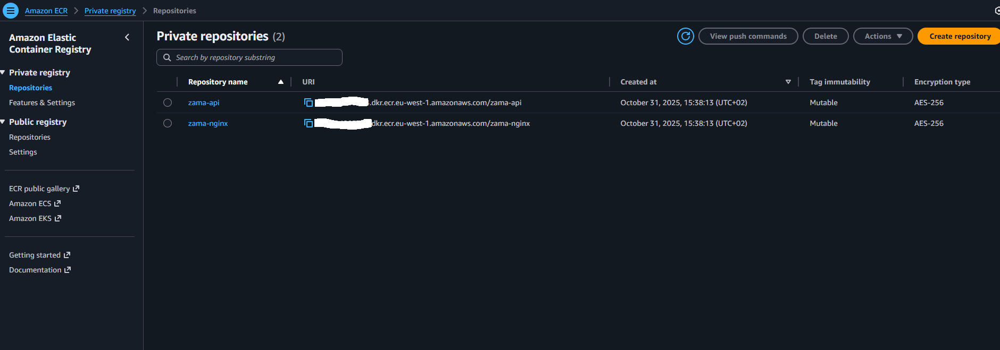
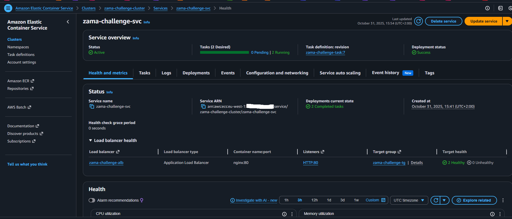
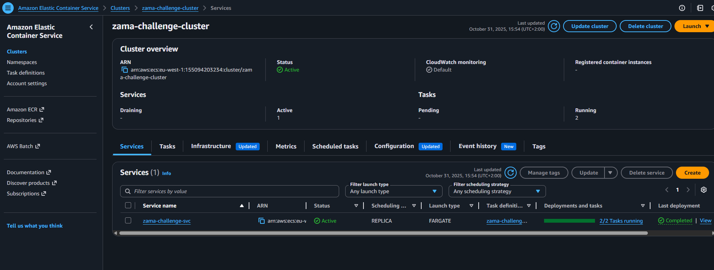
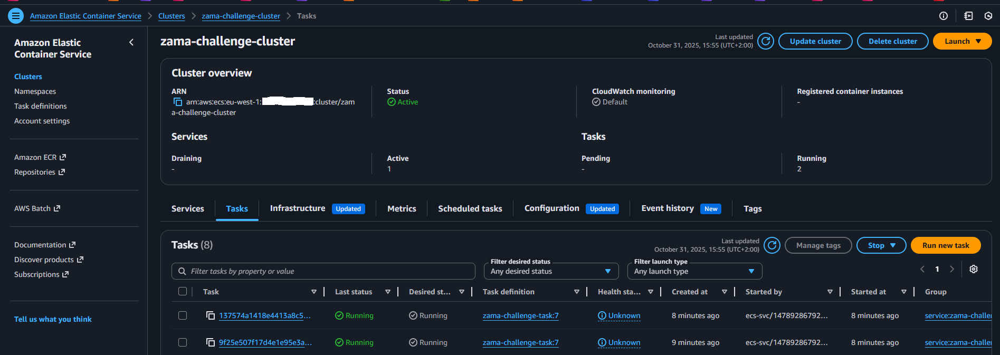

# Task Documentation

This document contains screenshots and visualizations of the deployed infrastructure and monitoring setup.

## Script for checking

```bash
#!/bin/bash

while true; do
    timestamp=$(date '+%Y-%m-%d %H:%M:%S')
    echo "[$timestamp] Making request to zama-challenge-alb-1455990262.eu-west-1.elb.amazonaws.com"

    curl -H 'X-Api-Key: TXlfc3VwZXJfRHVwZXJfTWVHYV9TZUNyRXRfS2VZ' -H 'Content-Type: application/json'   -d '{"a": 5, "b": 40}'  zama-challenge-alb-1455990262.eu-west-1.elb.amazonaws.com/sum
    curl http://zama-challenge-alb-1455990262.eu-west-1.elb.amazonaws.com/readyz
    curl http://zama-challenge-alb-1455990262.eu-west-1.elb.amazonaws.com/healthz

    echo ""
    echo "---"
done
```

Answer example:

```log
---
[2025-10-31 14:03:56] Making request to zama-challenge-alb-1455990262.eu-west-1.elb.amazonaws.com
{"sum":45}
ready{"status":"ok","uptime_seconds":1046.4}
---
[2025-10-31 14:03:57] Making request to zama-challenge-alb-1455990262.eu-west-1.elb.amazonaws.com
{"sum":45}
ready{"status":"ok","uptime_seconds":1046.9}
---
```

---

## Load Balancer



*Application Load Balancer (ALB) configuration showing listeners, availability zones, security groups, and DNS name for routing traffic to ECS tasks.*

---

## ALB Target Group



*ALB Target Group configuration displaying registered targets, health check settings, and target health status for the ECS service.*

---

## CloudWatch Alarm



*CloudWatch alarm configuration for monitoring ALB 5xx errors and triggering notifications when thresholds are exceeded.*

---

## CloudWatch Dashboard



*CloudWatch dashboard displaying key metrics including ALB performance, ECS CPU utilization, and service health indicators.*

---

## E1S Dashboard



*E1S dashboard overview showing system-level metrics and performance indicators.*

---

## ECR Image



*Container image stored in Amazon Elastic Container Registry (ECR) with tags and vulnerability scan results.*

---

## ECR Registry



*Amazon ECR registry showing all container repositories for the zama-api and zama-nginx services.*

---

## ECS Dashboard



*Amazon ECS dashboard displaying cluster information, running tasks, and service status.*

---

## ECS Service



*ECS service configuration showing desired count, running tasks, deployment status, and load balancer integration.*

---

## ECS Task



*ECS task definition details including container configurations, environment variables, resource allocations, and networking settings.*
